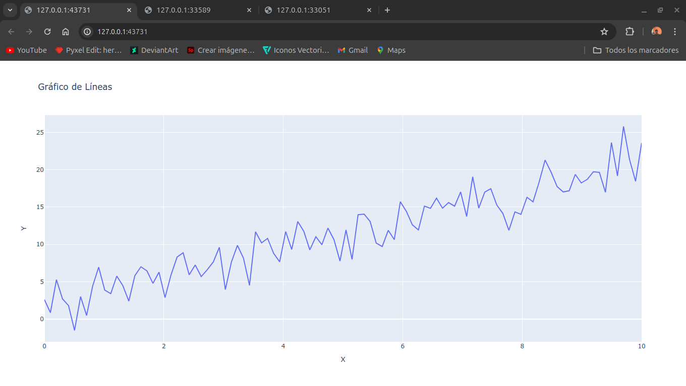
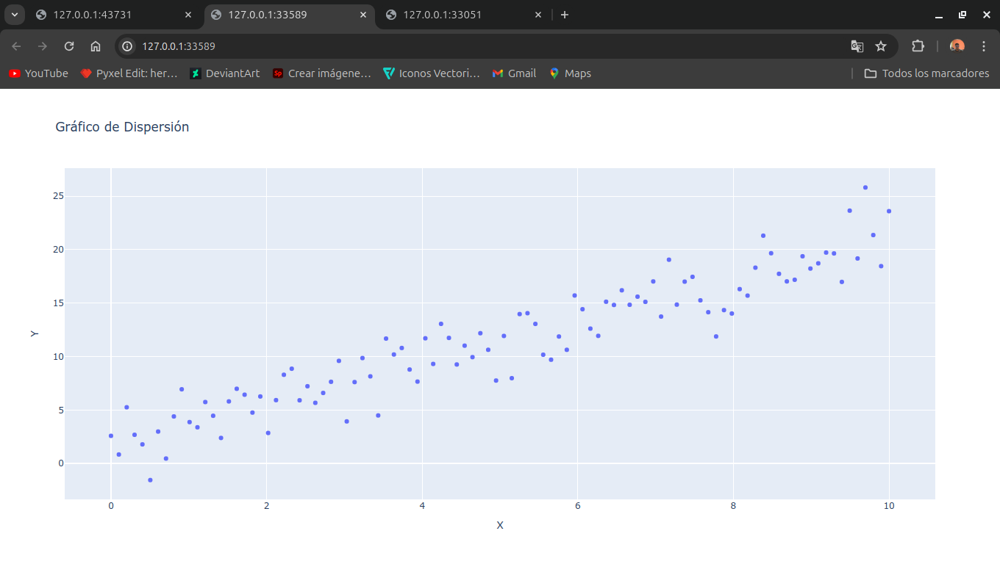
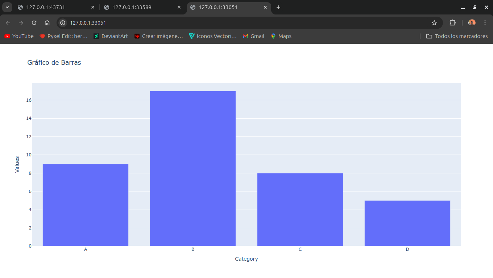
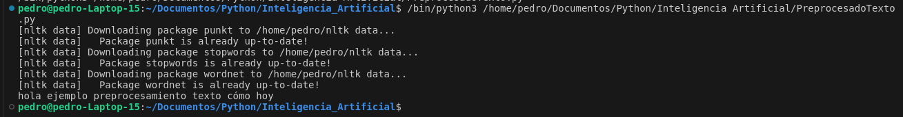
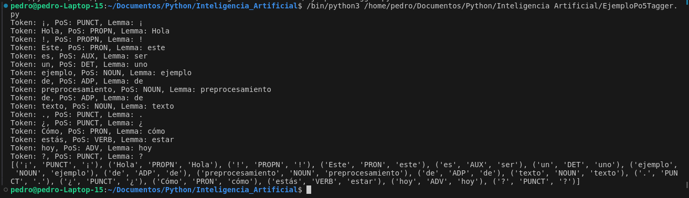
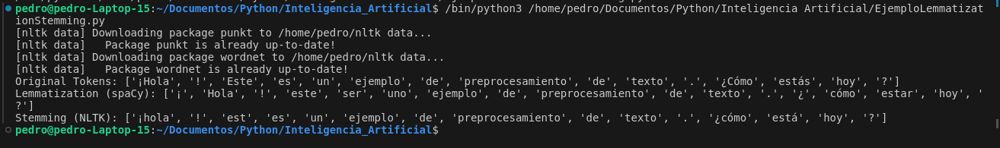
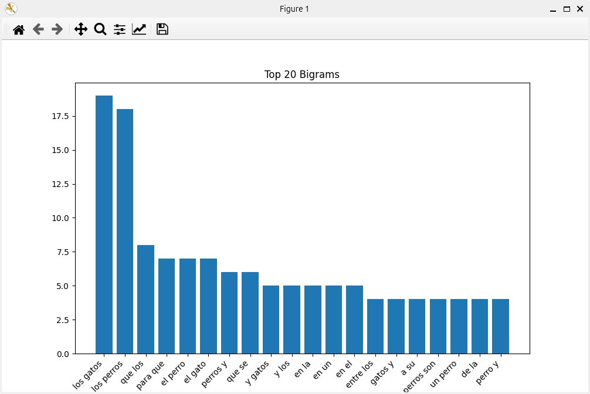
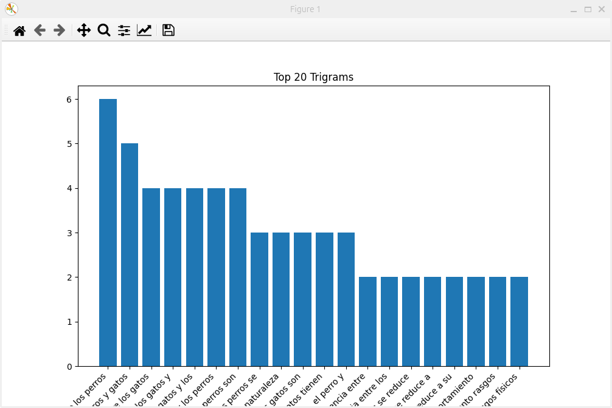
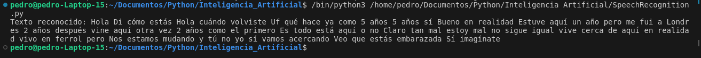

_PEDRO JOSE AGUILAR VAIDES
7690-20-8927_

# Practica 04
## Casos prácticos en distintos casos de uso

Se realizaran los siguientes ejercicios acerca de inteligencia artificial **python**

I. 3 gráficos generados con Plotly Express

II. 1 ejemplo de preprocesado de texto

III. 1 ejemplo con el PoS tagger de spaCy

IV. 1 ejemplo comparando lemmatization y stemming

V. 1 extracción de bigramas y trigramas y la visualización de los más frecuentes (preferible usar un documento de al menos 1000 palabras de un tema concreto)

VI. 1 prueba con SpeechRecognition (audio grabado, con micrófono, o descargado de Internet)

### Gráficos generados con Plotly

Fragmento de código:

```python
# Gráfico de líneas
fig_line = px.line(df, x='X', y='Y', title='Gráfico de Líneas')
fig_line.show()

# Gráfico de dispersión
fig_scatter = px.scatter(df, x='X', y='Y', title='Gráfico de Dispersión')
fig_scatter.show()

# Generar categorías para un gráfico de barras
categories = ['A', 'B', 'C', 'D']
values = np.random.randint(5, 20, size=len(categories))
df_bar = pd.DataFrame({
    'Category': categories,
    'Values': values
})

# Gráfico de barras
fig_bar = px.bar(df_bar, x='Category', y='Values', title='Gráfico de Barras')
fig_bar.show()
```

Gráficas






### Ejemplo de preprocesado de texto

Para este ejemplo, usaremos bibliotecas comunes como nltk y re para realizar varias tareas de preprocesamiento, que incluyen:

1. Eliminación de caracteres especiales.
    ```python
    text = re.sub(r'[^\w\s]', '', text)
    ```
2. Tokenización.
    ```python
    tokens = word_tokenize(text)
    ```
3. Conversión a minúsculas.
    ```python
    tokens = [token.lower() for token in tokens]
    ```
4. Eliminación de stopwords.
    ```python
    stop_words = set(stopwords.words('spanish'))
    tokens = [token for token in tokens if token not in stop_words]
    ```
5. Lematización.
    ```python
    lemmatizer = WordNetLemmatizer()
    tokens = [lemmatizer.lemmatize(token) for token in tokens]
    ```

Salida:

Este ejemplo muestra cómo preprocesar texto en español eliminando caracteres especiales, tokenizando, convirtiendo a minúsculas, eliminando stopwords y lematizando los tokens.

### Ejemplo con el PoS tagger de spaCy

Código para el Preprocesado de Texto y Etiquetado de Partes del Discurso

```python
import spacy

# Cargar el modelo de spaCy para español
nlp = spacy.load('es_core_news_sm')

# Ejemplo de texto
text = "¡Hola! Este es un ejemplo de preprocesamiento de texto. ¿Cómo estás hoy?"

# Procesar el texto con spaCy
doc = nlp(text)

# Extraer y mostrar tokens y sus etiquetas PoS
for token in doc:
    print(f'Token: {token.text}, PoS: {token.pos_}, Lemma: {token.lemma_}')

# También puedes extraer solo los tokens y sus etiquetas PoS en una lista
tokens_pos = [(token.text, token.pos_, token.lemma_) for token in doc]

print(tokens_pos)
```

Resumen del Funcionamiento:
1. **Carga de Biblioteca y Modelo:** Se carga spaCy y el modelo preentrenado en español.
2. **Procesamiento del Texto:** El texto de ejemplo se procesa con spaCy, convirtiéndolo en un objeto Doc que contiene información estructurada sobre el texto.
3. **Extracción de Información:** Se extraen y muestran los tokens junto con sus etiquetas PoS y lemas, proporcionando una vista detallada de la estructura gramatical del texto.

Este proceso de preprocesamiento es crucial en muchas aplicaciones de procesamiento del lenguaje natural (NLP), como la clasificación de texto, la extracción de información, y el análisis sintáctico, ya que transforma el texto en una forma estructurada que puede ser utilizada por algoritmos de aprendizaje automático y otras técnicas analíticas.

Salida:


### Ejemplo comparando lemmatization y stemming

Ejemplo en Python que compara la lematización y el stemming usando las bibliotecas nltk y spaCy. La lematización convierte palabras a su forma base o raíz utilizando el contexto gramatical, mientras que el stemming simplemente corta los sufijos de las palabras, lo que puede llevar a resultados menos precisos.

```python
# Inicializar lematizador de spaCy y stemming de NLTK
nlp = spacy.load('es_core_news_sm')
stemmer = PorterStemmer()
```

#### Diferencias clave
**Lematización:** La lematización produce palabras base que son válidas y existen en el lenguaje. Por ejemplo, "striped" se convierte en "stripe" y "feet" se convierte en "foot".
**Stemming:** El stemming puede producir formas de palabras que no existen en el lenguaje. Por ejemplo, "striped" se convierte en "stripe" y "feet" se mantiene igual.

Este ejemplo ilustra cómo la lematización y el stemming pueden afectar el preprocesamiento del texto y por qué podrías preferir una técnica sobre la otra dependiendo de la aplicación específica.

Salida:


### Extracción de bigramas y trigramas y la visualización de los más frecuentes (Texto: Perros y Gatos)

Para extraer bigramas y trigramas y visualizar los más frecuentes en un documento de texto en español, seguiremos estos pasos:

1. Cargar el documento de texto.
2. Preprocesar el texto.
3. Extraer bigramas y trigramas.
4. Visualizar los más frecuentes.

#### Definir funciones para preprocesar el texto, extraer n-gramas y visualizar los más frecuentes:
```python
def preprocess_text(text):
    text = text.lower()
    text = re.sub(r'[^a-záéíóúñü\s]', '', text)
    text = re.sub(r'\d+', '', text)
    return text

def extract_ngrams(text, n):
    tokens = nltk.word_tokenize(text)
    n_grams = ngrams(tokens, n)
    return [' '.join(grams) for grams in n_grams]

def plot_ngrams(ngrams, n, title):
    ngram_counts = Counter(ngrams)
    common_ngrams = ngram_counts.most_common(n)
    ngram_df = pd.DataFrame(common_ngrams, columns=['Ngram', 'Count'])
    plt.figure(figsize=(10, 6))
    plt.bar(ngram_df['Ngram'], ngram_df['Count'])
    plt.title(title)
    plt.xticks(rotation=45, ha='right')
    plt.show()
```

#### Cargar y preprocesar el documento de texto:
```python
with open('documento.txt', 'r', encoding='utf-8') as file:
    text = file.read()

preprocessed_text = preprocess_text(text)
```

### Extraer y visualizar los bigramas y trigramas más frecuentes:
```python
bigrams = extract_ngrams(preprocessed_text, 2)
plot_ngrams(bigrams, 20, 'Top 20 Bigrams')

trigrams = extract_ngrams(preprocessed_text, 3)
plot_ngrams(trigrams, 20, 'Top 20 Trigrams')
```

Salida:



### Prueba con SpeechRecognition

Para realizar una prueba de reconocimiento de voz en español utilizando la biblioteca SpeechRecognition en Python, seguiremos los siguientes pasos:

1. Instalar las bibliotecas necesarias.
2. Configurar el reconocimiento de voz para el idioma español.
3. Probar el reconocimiento de voz utilizando un archivo descargado de Internet.

Enlace del video que se utilizo para el audio
[Conversación](https://youtu.be/73nP_ZyupiQ?si=BUOoA4DT-UvvEk5d)

```python
import speech_recognition as sr
from pydub import AudioSegment

# Convertir un archivo de audio a formato compatible (si es necesario)
def convert_audio(file_path, output_format="wav"):
    audio = AudioSegment.from_file(file_path)
    output_path = f"{file_path.split('.')[0]}.{output_format}"
    audio.export(output_path, format=output_format)
    return output_path

# Reconocimiento de voz desde un archivo de audio
def recognize_from_file(file_path):
    recognizer = sr.Recognizer()
    audio_file = sr.AudioFile(file_path)
    with audio_file as source:
        audio = recognizer.record(source)
    try:
        text = recognizer.recognize_google(audio, language="es-ES")
        print("Texto reconocido:", text)
    except sr.UnknownValueError:
        print("No se pudo entender el audio")
    except sr.RequestError:
        print("No se pudo solicitar resultados al servicio de Google")

# Probar reconocimiento desde un archivo de audio
file_path = "ejemplo.mp3"  # Cambia esto por la ruta a tu archivo de audio
converted_file_path = convert_audio(file_path)
recognize_from_file(converted_file_path)
```

Salida:
